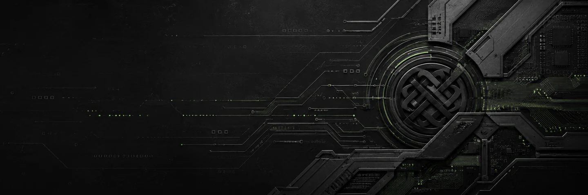
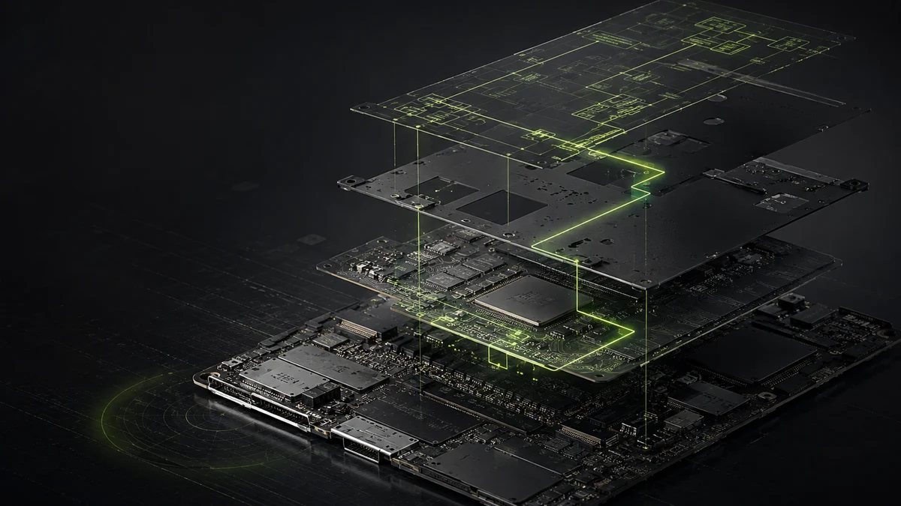
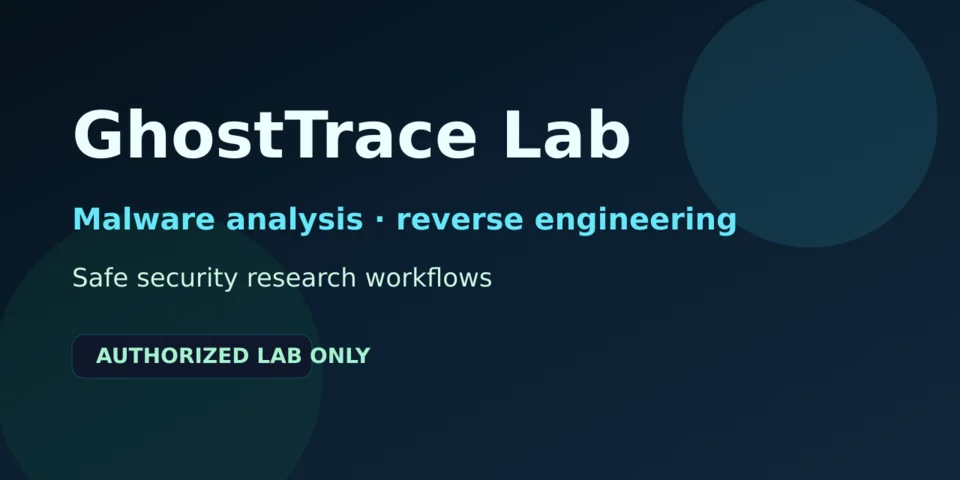
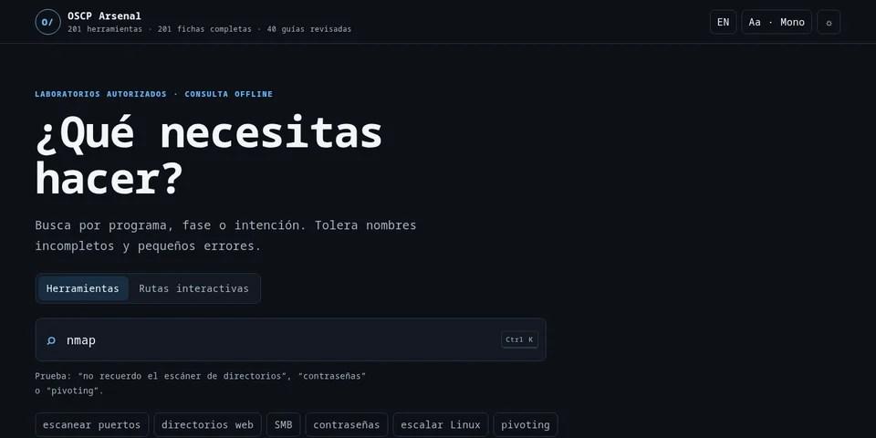
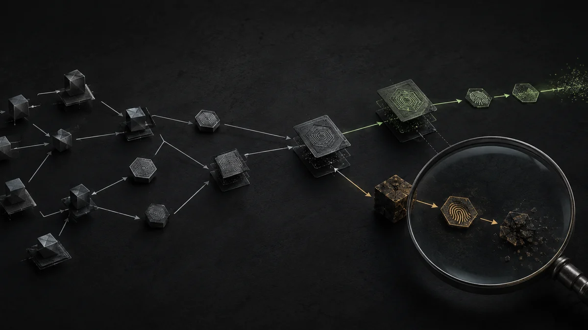
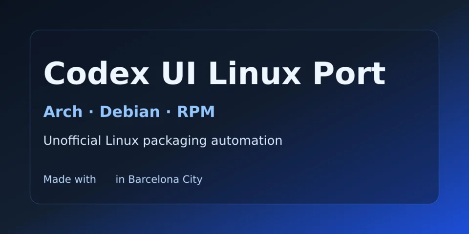
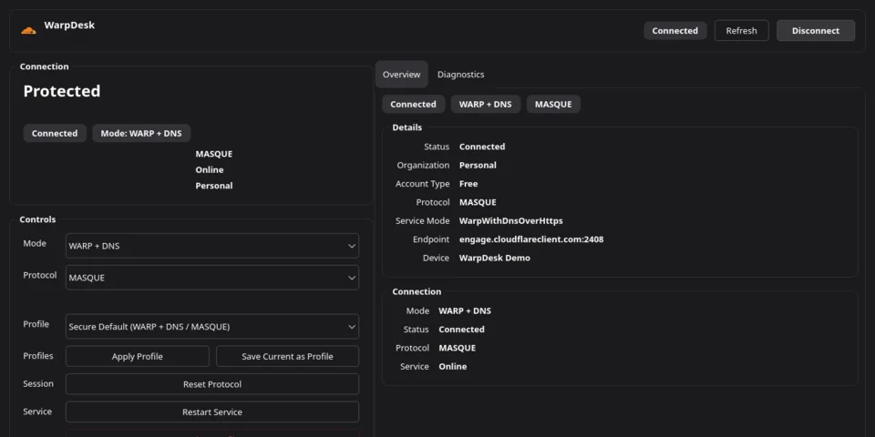

# 0xCyberBerserker

**Security engineering across hostile software, Linux systems, and the tooling between them.**

Offensive security / Reverse engineering / Linux and ARM64 / DevSecOps / Security automation

  
  
  

I take work from investigation to a result that can be reproduced, tested, and
maintained. Evidence-led debugging, explicit security boundaries, reversible
changes, and documentation built for operators.

## Work

### [SPC Glee A64 Linux](https://github.com/0xCyberBerserker/spc-glee-a64-linux)

**Unsupported Allwinner A64 hardware, cold-booted to systemd from microSD.**

Reproducible U-Boot, TF-A, and Linux tooling; hardware identification; a minimal,
hardware-tested Device Tree; and a board-support PATCH v1 submitted for upstream
review.

[Repository](https://github.com/0xCyberBerserker/spc-glee-a64-linux) / [Submitted source](https://github.com/0xCyberBerserker/spc-glee-a64-linux/tree/features/mainline-dts) / [Lore review](https://lore.kernel.org/all/20260906-b4-spc-glee-a64-v1-v1-0-621df2155e31@proton.me/)

`Linux kernel` `ARM64` `Device Tree` `U-Boot` `TF-A`

<table>
  <tr>
    <td width="50%" valign="top">
      
      <h3><a href="https://github.com/0xCyberBerserker/ghosttrace-lab">GhostTrace Lab</a></h3>
      
<strong>A persistent evidence workflow for reverse engineering and malware analysis.</strong>

      
Static and dynamic analysis across Ghidraaas, a Windows sandbox, x64dbg, and configurable local LLM reasoning.

      
<code>Reverse engineering</code> <code>Malware analysis</code> <code>Python</code>

    </td>
    <td width="50%" valign="top">
      
      <h3><a href="https://github.com/0xCyberBerserker/OSCP-Arsenal">OSCP Arsenal</a></h3>
      
<strong>201 tool sheets. 16 interactive methodology paths. Fully usable offline.</strong>

      
PWA and Qt/QML reader for Linux, Windows, and Android, with automated releases and OIDC/Sigstore provenance.

      
<code>Offensive security</code> <code>PWA</code> <code>Qt/QML</code>

    </td>
  </tr>
</table>

### [AUR Incident Defense Kit](https://github.com/0xCyberBerserker/aur-incident-defense-kit)

**Arch/AUR incident auditing without destructive remediation.**

Captures evidence hashes, correlates timelines, checks indicators, and produces a
reviewable remediation plan for supply-chain incidents.

[Repository](https://github.com/0xCyberBerserker/aur-incident-defense-kit)

`Incident response` `Supply-chain security` `Arch Linux`

<table>
  <tr>
    <td width="50%" valign="top">
      
      <h3><a href="https://github.com/0xCyberBerserker/codex-ui-linux-port">Codex UI Linux Port</a></h3>
      
<strong>Cross-distribution packaging with an explicit trust boundary.</strong>

      
Arch, Debian, and RPM automation with source provenance, hash verification, GitHub Actions, and documented privacy constraints.

      
<code>Linux packaging</code> <code>CI/CD</code> <code>Supply chain</code>

    </td>
    <td width="50%" valign="top">
      
      <h3><a href="https://github.com/0xCyberBerserker/warpdesk">WarpDesk</a></h3>
      
<strong>A Linux-native control surface for Cloudflare WARP.</strong>

      
PySide6 and Qt integration with profiles, diagnostics, multilingual UI, and rendering that follows the system palette.

      
<code>PySide6</code> <code>Qt</code> <code>Linux desktop</code>

    </td>
  </tr>
</table>

## Upstream

### Linux kernel

The SPC Glee A64 minimal board-support PATCH v1 is submitted for upstream
review. Its exact candidate DTB was hardware-tested through a cold boot to
systemd from microSD. [Source branch](https://github.com/0xCyberBerserker/spc-glee-a64-linux/tree/features/mainline-dts) / [Public review](https://lore.kernel.org/all/20260906-b4-spc-glee-a64-v1-v1-0-621df2155e31@proton.me/)

### HKUDS/CLI-Anything

The PowerShell installer for the Codex skill was merged upstream through
[PR #55](https://github.com/HKUDS/CLI-Anything/pull/55) and credited in the
[v0.2.0 release](https://github.com/HKUDS/CLI-Anything/releases/tag/v0.2.0).

## Activity

<!--START_SECTION:activity-->
1. 🚀 Published release [SPC Glee A64 Linux v0.1.0-alpha.1](https://github.com/0xCyberBerserker/spc-glee-a64-linux/releases/tag/v0.1.0-alpha.1) in [0xCyberBerserker/spc-glee-a64-linux](https://github.com/0xCyberBerserker/spc-glee-a64-linux)
2. 🚀 Published release [OSCP Arsenal v0.3.0](https://github.com/0xCyberBerserker/OSCP-Arsenal/releases/tag/v0.3.0) in [0xCyberBerserker/OSCP-Arsenal](https://github.com/0xCyberBerserker/OSCP-Arsenal)
3. 🚀 Published release [OSCP Knowledge Paths v0.2.0](https://github.com/0xCyberBerserker/OSCP-Arsenal/releases/tag/v0.2.0) in [0xCyberBerserker/OSCP-Arsenal](https://github.com/0xCyberBerserker/OSCP-Arsenal)
<!--END_SECTION:activity-->

## Community

- [token-rat-esp](https://github.com/0xCyberBerserker/token-rat-esp): a Spanish Codex skill for compact, maintainable engineering workflows.
- [Santuario Dana](https://github.com/0xCyberBerserker/paginaSantuarioDana): volunteer software supporting an animal sanctuary affected by the Valencia DANA disaster.
- [Mente Activa](https://github.com/0xCyberBerserker/mente-activa): accessible educational activities for older adults, families, and caregivers.

## Security community roots

Before the current engineering work, I served as a global moderator in two
historic Spanish-speaking security communities: Hack x Crack and Underc0de.
The [Cuadernos de Hack x Crack](https://elhacker.info/manuales/Hacking%20y%20Seguridad%20informatica/Cuadernos%20Hack%20x%20Crack/)
first pulled me toward computing and hacking.

[Hack x Crack archive](https://web.archive.org/web/20200923003951/https://hackxcrack.net/foro/profile/3hy%21/) / [Underc0de profile](https://underc0de.org/foro/index.php?action=profile;u=1971)

That background still shapes how I evaluate tools: useful beats decorative,
evidence beats noise, and public work should state its boundaries clearly.

## Contact

[LinkedIn](https://www.linkedin.com/in/jcarlosgl-offensive-security/) for professional contact.

  Made with 🖤 in Barcelona City 🇪🇸

